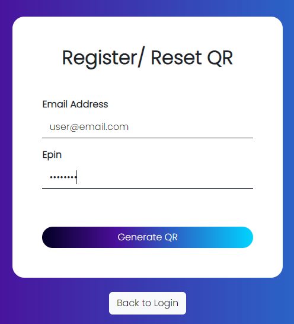
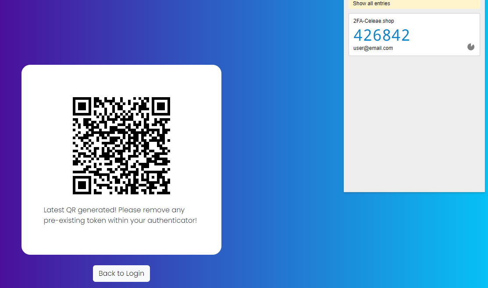
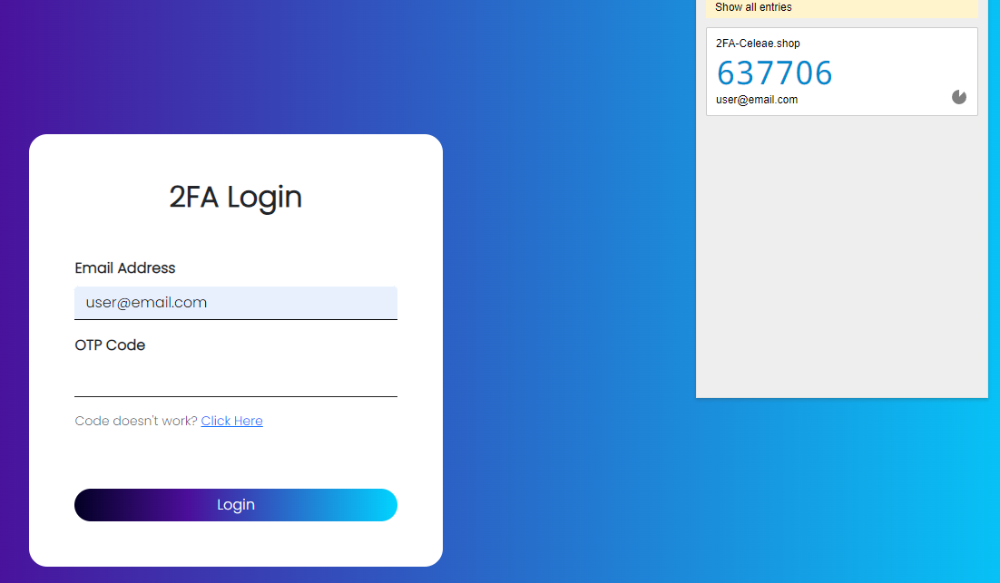

# 2FA
 

Access the live demo of the website [here](https://celeae.shop/2fa).
_Demo user:_ user@email.com
_Demo ePin:_ 88118811

## Project Summary
We often use 2FA as an added option for our login. But how does it work?
**Shared Secret**
* Both the server (authentication provider) and the client (user’s device) share a secret key. This secret key is typically encoded as a Base32 string.
**Time Interval**
* The TOTP algorithm relies on time intervals, typically set to 30 seconds.
**Generate OTP**
* The time is combined with the shared secret key to create an HMAC (Hash-based Message Authentication Code)
**Validation of OTP**
* The user enters the OTP generated by their TOTP client (e.g.google autheticator). The server then performs the same calculation using the shared secret and the current time step to generate the expected OTP. If the OTP entered by the user matches the server-generated OTP, authentication is successful.

## How to use?
Presume that the user and ePin has been initialied.
**Step 1 - Register/ Reset QR**
 
using the demo user and ePin enter them into the fields as seen

**Step 2 - QR code generated and registerd to device**
 
QR code should be generated as seen. With an authenticator (e.g. google authenticator), capture the QR code.

**Step 3 - Login with username and 2FA OTP from authenticator**
 
Enter the OTP code as seen from your authenticator. When successful, the server will return user with a "Login successful!"

## Challenges
**Device that is used to generate the OTP must be syncronized**
Ensure that time is accurate on your device. TOTP algorith as mention is extremely time sensitive.

**Server Side**
Must be keep syncronized to the NTP public server. In our project's case, we are using google's NTP server.

